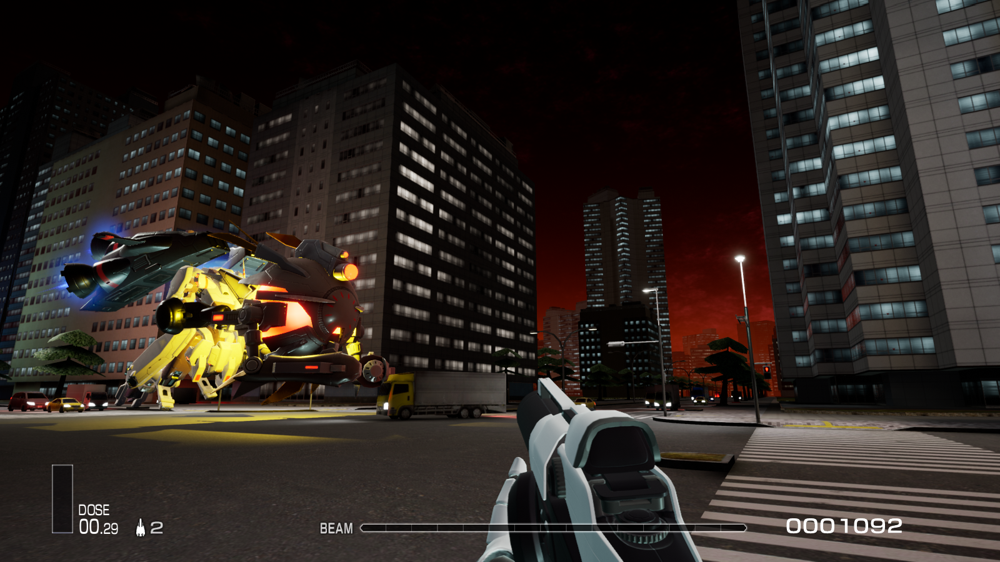

[简体中文](Readme/README.zhs.md) | [日本語](Readme/README.ja.md)

# Transform R-Type Final 2 into a First-Person Shooter!
This mod allows you to spawn the player from the Unreal Engine 4 First-Person Shooter template into a level and switch the currently controlled character.  
- Switching to the first-person player does not stop the scrolling. You will need to use other methods to adjust or disable the scrolling speed. It is highly recommended to use this mod alongside [RTF2DebugTools](https://github.com/BLACKujira/RTF2DebugToolsMod).
- This mod is currently very incomplete and has many issues. If you encounter black screens, falling into the void, or getting stuck in corners, try resetting the level to resolve these problems.

## Installation Guide
1. If you haven't installed *UE4SS* yet, please follow the [UE4SS Installation Guide](https://github.com/BLACKujira/RTF2ModdingGuide/blob/master/Chapter1_TheBasics/en/InstallingUE4SS.md) to install *UE4SS v3.0.0* and upgrade to *v3.0.1*.
2. Download `FPSPlayer.pak` from the [Releases](https://github.com/BLACKujira/FPSPlayerMod/releases) section.
3. Follow the instructions in [Installing Blueprint Mods](https://github.com/BLACKujira/RTF2ModdingGuide/blob/master/Chapter1_TheBasics/en/InstallingBlueprintMods.md) to install this mod.
4. If the installation is successful, you will see the mod's information in the `BP Mods` tab of the UE4SS console.

## Notes
- Do **not** rename `FPSPlayer.pak`. UE4SS relies on the file name to locate the mod entry point. Renaming the file will cause the mod to fail to load.
- Older versions of *UE4SS* or other *Blueprint mod loaders* may also be able to run this mod.

## Usage
After entering a level, switch UE4SS to the `BP Mods` tab, expand `FPSPlayer`, and then expand `Mod Buttons`. You will see four buttons that allow you to use the mod's features.

### SpawnFPSPlayer Button
- Spawns an FPS player above the currently controlled R-craft and switches control and camera focus to the FPS player. If the FPS player is already active, this button removes the current FPS player and spawns a new one at the R-craft's location.

### SwitchCrosshair Button
- Toggles the display of the crosshair at the center of the screen. This feature is still under development; currently, the crosshair does not accurately indicate where bullets will hit.

### ControlAircraftPlayer Button
- If you are currently controlling the FPS player, this button temporarily switches control and camera focus back to the R-craft without removing the FPS player.

### ControlFPSPlayer Button
- If you are currently controlling the R-craft and there is an active FPS player in the level, this button switches control and camera focus to the FPS player.

## Screenshots
  
  
  

## Final Notes
- To contribute to the development of this project, open the project file using `Unreal Engine 4.26.2` with a C++ compiler.
- I have yet to figure out how the player's weapons in the game deal damage to enemies. Currently, bullets fired by the FPS player only damage certain enemies, while others remain unaffected.