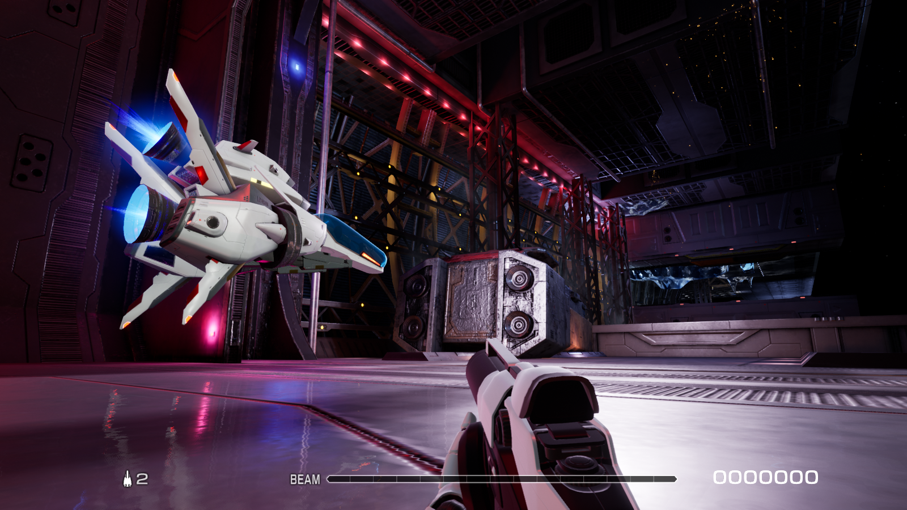
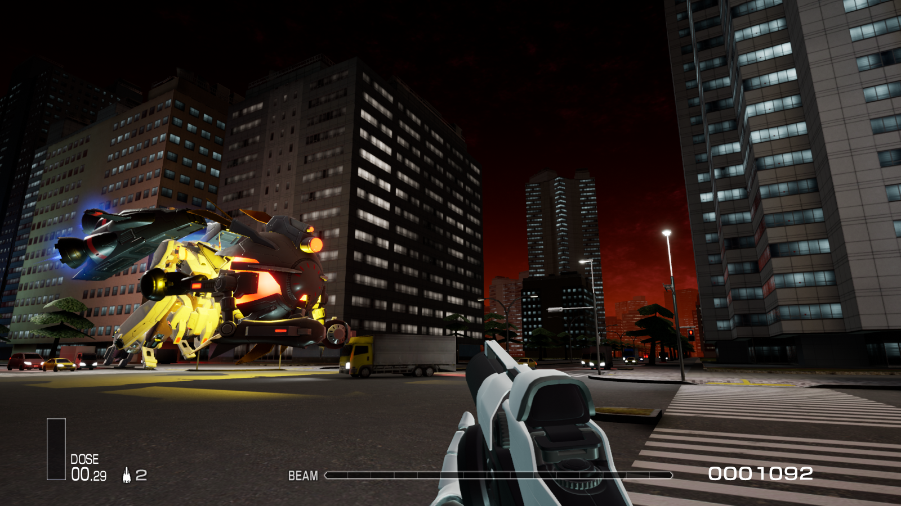
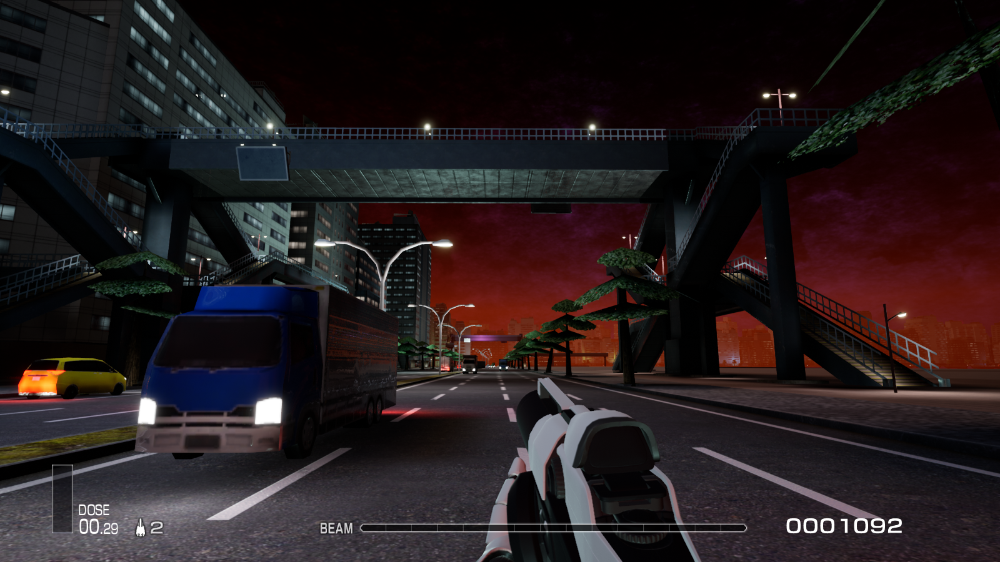

# 将R-Type Final 2变成第一人称射击游戏！
这个Mod可以将UE4第一人称射击游戏模板中的玩家生成到关卡中，并切换当前控制的玩家。
- 切换到第一人称玩家后并不会停止卷轴，需要使用其他的办法改变卷轴的速度或停用卷轴。强烈建议和 [RTF2DebugTools](https://github.com/BLACKujira/RTF2DebugToolsMod) 一起使用。
- 这个Mod目前非常的不完善，有非常多的问题。如果遇到黑屏、落入虚空，卡在角落等情况，可以通过重置关卡解决这些问题。

## 安装教程
1. 如果你还没有安装 *UE4SS* ，请按照 [安装UE4SS](https://github.com/BLACKujira/RTF2ModdingGuide/blob/master/Chapter1_TheBasics/zhs/%E5%AE%89%E8%A3%85UE4SS.md) 中的教程安装 *UE4SS v3.0.0* ，并升级到 *v3.0.1*
2. 下载 [Releases](https://github.com/BLACKujira/FPSPlayerMod/releases) 中的 `FPSPlayer.pak`。
3. 按照 [安装蓝图Mod](https://github.com/BLACKujira/RTF2ModdingGuide/blob/master/Chapter1_TheBasics/zhs/%E5%AE%89%E8%A3%85%E8%93%9D%E5%9B%BEMod.md) 中的教程安装这个Mod
4. 如果安装成功，在UE4SS控制台的 `BP Mods` 标签页中可以看到Mod的信息。

## 注意点
- 不要重命名 `FPSPlayer.pak` ，UE4SS依赖文件名寻找MOD的入口，如果重命名会导致MOD无法正常运作
- 更低版本的 *UE4SS* 或者其他的 *蓝图Mod加载器* 或许也能运行这个Mod。

## 使用方法
进入关卡之后，将UE4SS切换到 `BP Mods` 标签页，展开 `FPSPlayer` ，再展开 `Mod Buttons` ，你可以看到4个按钮，通过这些按钮可以调用Mod的功能。

### SpawnFPSPlayer 按钮
- 在当前玩家的R战机上方生成一个FPS玩家，并将当前控制的玩家和镜头的目标切换为FPS玩家。如果当前已经切换到FPS玩家，则删除当前操控的FPS玩家，并在R战机处生成一个新的玩家。

### SwitchCrosshair 按钮
- 切换屏幕中心十字准星的显示。目前还有一些问题，实际上，当前的准星并没有指向子弹瞄准的位置。

### ControlAircraftPlayer 按钮
- 如果当前操控的是FPS玩家，则暂时将操控对象和镜头目标切换回R战机，但不会删除之前操控的FPS玩家。

### ControlFPSPlayer 按钮
- 如果当前操控的是R战机，并且关卡中有没被删除的FPS玩家，则将控制对象和镜头切换到这个FPS玩家。

## 图片
  
  
  

## 最后
- 如果要协助开发这个项目，请使用配备C++编译器的 `Unreal Engine 4.26.2` 打开项目文件。
- 我还没有搞懂游戏中玩家的武器是如何对敌人造成伤害的，目前FPS玩家发射的子弹只能对一部分敌人造成伤害，对另一部分敌人没有效果。